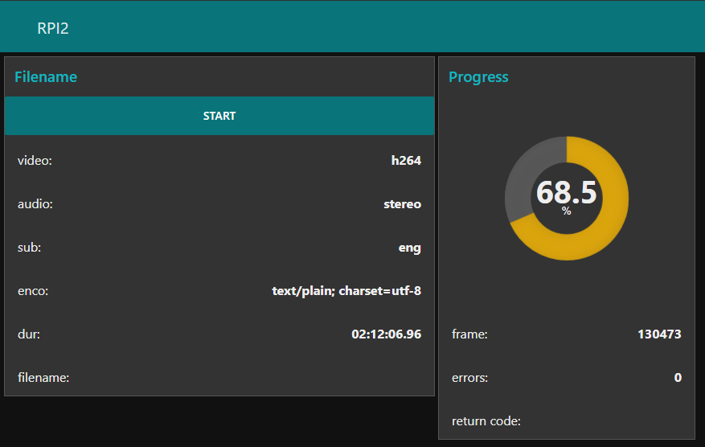

# Node-RED-Ffmpeg
Node-RED flow to execute FFmpeg transcoding

Running on a RPI2 acting as a NAS/MiniDLNA server

Install vsftpd:
https://www.digitalocean.com/community/tutorials/how-to-set-up-vsftpd-for-a-user-s-directory-on-ubuntu-16-04

Install Samba:
https://www.htpcguides.com/create-samba-share-raspberry-pi/

Install MiniDLNA:
https://www.htpcguides.com/install-latest-readymedia-minidlna-ubuntu/

Install Node-RED:
https://nodered.org/docs/hardware/raspberrypi

<br/>


<br/>

```
[{"id":"18562cf9.747f13","type":"exec","z":"76e1cc98.df4f04","command":"ffmpeg","addpay":true,"append":"","useSpawn":"true","timer":"","oldrc":false,"name":"","x":270,"y":400,"wires":[[],["276112ad.64f75e"],["ef30587a.89a398"]]},{"id":"ef30587a.89a398","type":"change","z":"76e1cc98.df4f04","name":"done","rules":[{"t":"set","p":"complete","pt":"msg","to":"true","tot":"bool"}],"action":"","property":"","from":"","to":"","reg":false,"x":330,"y":460,"wires":[["276112ad.64f75e"]]},{"id":"276112ad.64f75e","type":"join","z":"76e1cc98.df4f04","name":"","mode":"custom","build":"string","property":"payload","propertyType":"msg","key":"topic","joiner":"\\n","joinerType":"str","accumulate":false,"timeout":"","count":"","reduceRight":false,"reduceExp":"","reduceInit":"","reduceInitType":"","reduceFixup":"","x":390,"y":400,"wires":[["566c53aa.b9a84c"]]},{"id":"49e3c5ea.8737cc","type":"switch","z":"76e1cc98.df4f04","name":"","property":"payload","propertyType":"msg","rules":[{"t":"regex","v":"(Stream.*Audio)","vt":"str","case":false},{"t":"regex","v":"(Stream.*Video)","vt":"str","case":false},{"t":"regex","v":"(Stream.*Subtitle)","vt":"str","case":false},{"t":"cont","v":"NUMBER_OF_FRAMES:","vt":"str"},{"t":"cont","v":"Duration","vt":"str"}],"checkall":"true","repair":false,"outputs":5,"x":630,"y":400,"wires":[["25673ef1.4b74d2"],["fee717be.cd2618"],["3256a557.7e104a"],["402de22b.b0657c"],["203474b1.bdd46c"]]},{"id":"566c53aa.b9a84c","type":"split","z":"76e1cc98.df4f04","name":"","splt":"\\n","spltType":"str","arraySplt":1,"arraySpltType":"len","stream":false,"addname":"","x":510,"y":400,"wires":[["49e3c5ea.8737cc","2d8f6c05.d55c14"]]},{"id":"b7b6e04.9e77c2","type":"switch","z":"76e1cc98.df4f04","name":"stereo","property":"payload","propertyType":"msg","rules":[{"t":"eq","v":"stereo","vt":"str"},{"t":"else"}],"checkall":"true","repair":false,"outputs":2,"x":990,"y":320,"wires":[["90feecc2.2307b"],["f5aa5e46.7983a"]]},{"id":"7ed74892.ee1038","type":"function","z":"76e1cc98.df4f04","name":"-i","func":"return {payload: \"-i \" + flow.get(\"input\") + flow.get(\"filename\")};","outputs":1,"noerr":0,"x":150,"y":400,"wires":[["18562cf9.747f13","7177c220.b4212c"]]},{"id":"7a743dff.6fd1a4","type":"exec","z":"76e1cc98.df4f04","command":"ffmpeg","addpay":true,"append":"","useSpawn":"true","timer":"","oldrc":false,"name":"","x":270,"y":660,"wires":[[],["a87cacd9.9487b"],["814fcb3.3192238","a87cacd9.9487b"]]},{"id":"a87cacd9.9487b","type":"switch","z":"76e1cc98.df4f04","name":"switch","property":"payload","propertyType":"msg","rules":[{"t":"cont","v":"frame=","vt":"str"},{"t":"cont","v":"Error","vt":"str"},{"t":"cont","v":"Invalid","vt":"str"}],"checkall":"true","repair":false,"outputs":3,"x":390,"y":640,"wires":[["95683aca.e5f4f8"],["477065b7.967d7c"],["477065b7.967d7c"]]},{"id":"95683aca.e5f4f8","type":"function","z":"76e1cc98.df4f04","name":"get frame","func":"var o = msg.payload.indexOf(\"fps=\") - 1;\no = msg.payload.substring(6, o).trim();\nvar frames = flow.get(\"frames\");\nflow.set(\"progress\", o);\nreturn {payload: Math.floor(1000 * o / frames) / 10, topic: o};","outputs":1,"noerr":0,"x":540,"y":620,"wires":[["f990ac0b.b5e23","6b5e05b1.81b7ec"]]},{"id":"b075bcd8.c00a4","type":"switch","z":"76e1cc98.df4f04","name":"h264","property":"payload","propertyType":"msg","rules":[{"t":"eq","v":"h264","vt":"str"},{"t":"else"}],"checkall":"true","repair":false,"outputs":2,"x":990,"y":360,"wires":[["e7d4817b.d5144"],["4e734fa0.6ce38"]]},{"id":"4e734fa0.6ce38","type":"change","z":"76e1cc98.df4f04","name":"to libx264","rules":[{"t":"set","p":"payload","pt":"msg","to":"-c:v libx264 -preset slow -crf 22","tot":"str"}],"action":"","property":"","from":"","to":"","reg":false,"x":1120,"y":420,"wires":[["1e82b11c.303eaf"]]},{"id":"f5aa5e46.7983a","type":"change","z":"76e1cc98.df4f04","name":"to stereo","rules":[{"t":"set","p":"payload","pt":"msg","to":"-ac 2 -af \"pan=stereo|FL=FC+0.30*FL+0.30*BL|FR=FC+0.30*FR+0.30*BR\"","tot":"str"}],"action":"","property":"","from":"","to":"","reg":false,"x":1120,"y":340,"wires":[["1e82b11c.303eaf"]]},{"id":"e7d4817b.d5144","type":"change","z":"76e1cc98.df4f04","name":"v copy","rules":[{"t":"set","p":"payload","pt":"msg","to":"-c:v copy","tot":"str"}],"action":"","property":"","from":"","to":"","reg":false,"x":1110,"y":380,"wires":[["1e82b11c.303eaf"]]},{"id":"90feecc2.2307b","type":"change","z":"76e1cc98.df4f04","name":"a copy","rules":[{"t":"set","p":"payload","pt":"msg","to":"-c:a copy","tot":"str"}],"action":"","property":"","from":"","to":"","reg":false,"x":1110,"y":300,"wires":[["1e82b11c.303eaf"]]},{"id":"1e82b11c.303eaf","type":"join","z":"76e1cc98.df4f04","name":"","mode":"custom","build":"string","property":"payload","propertyType":"msg","key":"topic","joiner":" ","joinerType":"str","accumulate":false,"timeout":"","count":"3","reduceRight":false,"reduceExp":"","reduceInit":"","reduceInitType":"","reduceFixup":"","x":1250,"y":380,"wires":[["7e10da8f.217494"]]},{"id":"83edbfd4.cb52a","type":"function","z":"76e1cc98.df4f04","name":"-i srt","func":"var newMsg = {payload: \"-i /home/admin/local/inbound/\" + flow.get(\"filename\").replace(\"mkv\", \"srt\") + \" \" + msg.payload.replace(\"ENCODING\", flow.get(\"encoding\"))};\nreturn newMsg;","outputs":1,"noerr":0,"x":1370,"y":420,"wires":[["773db4c8.84162c"]]},{"id":"83c3730b.67971","type":"change","z":"76e1cc98.df4f04","name":"-c:s","rules":[{"t":"set","p":"payload","pt":"msg","to":"-sub_charenc ENCODING -map 0:v -map 0:a -c copy -map 1 -c:s:0 srt -metadata:s:s:0 language=spa","tot":"str"}],"action":"","property":"","from":"","to":"","reg":false,"x":1250,"y":420,"wires":[["83edbfd4.cb52a"]]},{"id":"2012efb3.7d2b8","type":"link in","z":"76e1cc98.df4f04","name":"inErrors","links":["477065b7.967d7c","e86fd235.89705"],"x":475,"y":20,"wires":[["7d12ad04.adda54"]]},{"id":"477065b7.967d7c","type":"link out","z":"76e1cc98.df4f04","name":"outProgress","links":["2012efb3.7d2b8"],"x":495,"y":660,"wires":[]},{"id":"402de22b.b0657c","type":"function","z":"76e1cc98.df4f04","name":"frames","func":"var i = msg.payload.indexOf(\"NUMBER_OF_FRAMES:\");\nvar o =  msg.payload.substr(i+17, 8).trim();\nflow.set(flow.get(\"stream\") + \"-frames\", o);\nreturn {payload: o};","outputs":1,"noerr":0,"x":750,"y":440,"wires":[[]]},{"id":"8224fc20.79704","type":"switch","z":"76e1cc98.df4f04","name":"ext","property":"extension","propertyType":"flow","rules":[{"t":"eq","v":"mkv","vt":"str"},{"t":"eq","v":"srt","vt":"str"},{"t":"else"}],"checkall":"true","repair":false,"outputs":3,"x":550,"y":140,"wires":[["e107d360.fdd82"],["63d56795.5325c8"],[]]},{"id":"cf1fd06c.8b63b","type":"inject","z":"76e1cc98.df4f04","name":"onStart","topic":"","payload":"","payloadType":"num","repeat":"","crontab":"","once":true,"onceDelay":"1","x":100,"y":40,"wires":[["4a1fa201.0e0f4c"]]},{"id":"4a1fa201.0e0f4c","type":"function","z":"76e1cc98.df4f04","name":"init","func":"flow.set(\"input\", \"/home/admin/local/inbound/\")\nflow.set(\"output\", \"/home/admin/local/movies/\")\nflow.set(\"failed\", \"/home/admin/local/failed/\")\nflow.set(\"encoding\", \"CP1252\")\n//flow.set(\"encoding\", \"ISO-8859-1\")\nflow.set(\"size\", 0)\nflow.set(\"fps\", 0)\nflow.set(\"progress\", 0);\nflow.set(\"filename\", \"\");\nflow.set(\"audio\", \"\");\nflow.set(\"video\", \"\");\nflow.set(\"subtitle\", \"\");\nflow.set(\"audio-frames\", 0);\nflow.set(\"video-frames\", 0);\nflow.set(\"subtitle-frames\", 0);\nreturn {payload: 0};","outputs":1,"noerr":0,"x":230,"y":40,"wires":[["c0a26e7c.323fc","7d12ad04.adda54","cb7f3f2.04ec0c"]]},{"id":"c0a26e7c.323fc","type":"link out","z":"76e1cc98.df4f04","name":"ouStart","links":["2510a2f2.7e171e","4197c437.b9b4ec","65b4a9bd.242de8","69e33e92.b9471"],"x":315,"y":60,"wires":[]},{"id":"65b4a9bd.242de8","type":"link in","z":"76e1cc98.df4f04","name":"inDonut","links":["c0a26e7c.323fc","e86fd235.89705"],"x":615,"y":580,"wires":[["f990ac0b.b5e23","6b5e05b1.81b7ec"]]},{"id":"814fcb3.3192238","type":"json","z":"76e1cc98.df4f04","name":"","property":"payload","action":"obj","pretty":false,"x":390,"y":700,"wires":[["7b46f63d.1e33a8","c266d432.d5f778"]]},{"id":"7b46f63d.1e33a8","type":"switch","z":"76e1cc98.df4f04","name":"rc","property":"payload.code","propertyType":"msg","rules":[{"t":"eq","v":"0","vt":"str"},{"t":"else"}],"checkall":"true","repair":false,"outputs":2,"x":510,"y":700,"wires":[["6a5e8222.13cd2c"],["703f8903.8cbb28"]]},{"id":"25673ef1.4b74d2","type":"function","z":"76e1cc98.df4f04","name":"audio","func":"flow.set(\"stream\", \"audio\");\nvar a = msg.payload.split(\",\")[2].trim();\nflow.set(\"audio\", a);\nvar o = {payload: a}\nreturn o;","outputs":1,"noerr":0,"x":750,"y":320,"wires":[["b7b6e04.9e77c2","c74417a8.995e88"]]},{"id":"fee717be.cd2618","type":"function","z":"76e1cc98.df4f04","name":"video","func":"flow.set(\"stream\", \"video\");\nvar v = msg.payload.split(\":\")[3].split(\" \")[1];\nflow.set(\"video\", v);\n\nvar i = msg.payload.indexOf(\"fps\");\nvar f =  msg.payload.substr(0, i);\nf = f.substr(f.lastIndexOf(\",\") + 1).trim();\nflow.set(\"fps\", f);\n\nvar o = {payload: v, topic: f};\nreturn o;","outputs":1,"noerr":0,"x":750,"y":360,"wires":[["b075bcd8.c00a4","77e1422.4fff5bc"]]},{"id":"3256a557.7e104a","type":"function","z":"76e1cc98.df4f04","name":"sub","func":"flow.set(\"stream\", \"subtitle\");\nvar s = msg.payload.split(\"\\(\")[1].split(\"\\)\")[0];\nvar o = {payload: s};\nflow.set(\"subtitle\", s);\nreturn o;","outputs":1,"noerr":0,"x":750,"y":400,"wires":[["e1096f3c.43aa5"]]},{"id":"7e10da8f.217494","type":"switch","z":"76e1cc98.df4f04","name":"ext","property":"extension","propertyType":"flow","rules":[{"t":"eq","v":"mkv","vt":"str"},{"t":"eq","v":"srt","vt":"str"}],"checkall":"true","repair":false,"outputs":2,"x":1370,"y":380,"wires":[["773db4c8.84162c"],["83c3730b.67971"]]},{"id":"4ee1d1f4.1dd85","type":"switch","z":"76e1cc98.df4f04","name":"ext","property":"extension","propertyType":"flow","rules":[{"t":"eq","v":"srt","vt":"str"},{"t":"else"}],"checkall":"true","repair":false,"outputs":2,"x":770,"y":680,"wires":[["d6b35c82.80ee6"],["8e192a68.23cc58"]]},{"id":"d6b35c82.80ee6","type":"function","z":"76e1cc98.df4f04","name":"file","func":"return {\n    payload: flow.get(\"filename\").replace(\"mkv\", \"srt\")\n};","outputs":1,"noerr":0,"x":890,"y":660,"wires":[["63646719.21a7e8"]]},{"id":"b581db3.6393728","type":"change","z":"76e1cc98.df4f04","name":"last","rules":[{"t":"set","p":"payload","pt":"msg","to":"","tot":"str"}],"action":"","property":"","from":"","to":"","reg":false,"x":1110,"y":520,"wires":[["1e82b11c.303eaf"]]},{"id":"2d8f6c05.d55c14","type":"switch","z":"76e1cc98.df4f04","name":"last","property":"parts.index","propertyType":"msg","rules":[{"t":"eq","v":"msg.parts.count - 1","vt":"jsonata"}],"checkall":"true","repair":false,"outputs":1,"x":630,"y":520,"wires":[["9bb91e80.80f9b"]]},{"id":"850b4c3a.25a45","type":"change","z":"76e1cc98.df4f04","name":"grab","rules":[{"t":"set","p":"payload","pt":"msg","to":"payload[0]","tot":"msg"}],"action":"","property":"","from":"","to":"","reg":false,"x":310,"y":140,"wires":[["cb7f3f2.04ec0c","b26222a0.9e4b6"]]},{"id":"f43e16f6.34fab8","type":"switch","z":"76e1cc98.df4f04","name":"ext","property":"extension","propertyType":"flow","rules":[{"t":"else"},{"t":"eq","v":"srt","vt":"str"}],"checkall":"true","repair":false,"outputs":2,"x":770,"y":720,"wires":[["8e192a68.23cc58"],["c56881a9.6e5a4"]]},{"id":"c56881a9.6e5a4","type":"function","z":"76e1cc98.df4f04","name":"file","func":"return {\n    payload: flow.get(\"filename\").replace(\"mkv\", \"srt\")\n};","outputs":1,"noerr":0,"x":890,"y":740,"wires":[["cf8176fe.7a09e8"]]},{"id":"2510a2f2.7e171e","type":"link in","z":"76e1cc98.df4f04","name":"","links":["c0a26e7c.323fc","a541c6b8.919ea8"],"x":755,"y":280,"wires":[["c74417a8.995e88","77e1422.4fff5bc","e1096f3c.43aa5","7ed2cffb.10d24","f1dde25b.bb613"]]},{"id":"203474b1.bdd46c","type":"function","z":"76e1cc98.df4f04","name":"dur","func":"var i = msg.payload.indexOf(\"Duration:\");\nvar o =  msg.payload.substr(i+10, 11);\nflow.set(\"duration\", o);\nreturn {payload: o};","outputs":1,"noerr":0,"x":750,"y":480,"wires":[["7ed2cffb.10d24"]]},{"id":"a270bb7d.ed3368","type":"debug","z":"76e1cc98.df4f04","name":"","active":true,"tosidebar":true,"console":false,"tostatus":false,"complete":"false","x":150,"y":720,"wires":[]},{"id":"cb52057b.d66a68","type":"ui_button","z":"76e1cc98.df4f04","name":"","group":"e1bfb912.5c35c8","order":1,"width":0,"height":0,"passthru":false,"label":"Start","color":"","bgcolor":"","icon":"","payload":"","payloadType":"str","topic":"","x":70,"y":140,"wires":[["85e7e97d.3b1ba8"]]},{"id":"7d12ad04.adda54","type":"ui_text","z":"76e1cc98.df4f04","group":"fd0a284b.b1e9b8","order":3,"width":0,"height":0,"name":"","label":"errors:","format":"{{msg.payload}}","layout":"row-spread","x":550,"y":40,"wires":[]},{"id":"c74417a8.995e88","type":"ui_text","z":"76e1cc98.df4f04","group":"e1bfb912.5c35c8","order":4,"width":0,"height":0,"name":"","label":"audio:","format":"{{msg.payload}}","layout":"row-spread","x":870,"y":320,"wires":[]},{"id":"77e1422.4fff5bc","type":"ui_text","z":"76e1cc98.df4f04","group":"e1bfb912.5c35c8","order":3,"width":0,"height":0,"name":"","label":"video:","format":"{{msg.payload}}","layout":"row-spread","x":870,"y":360,"wires":[]},{"id":"e1096f3c.43aa5","type":"ui_text","z":"76e1cc98.df4f04","group":"e1bfb912.5c35c8","order":5,"width":0,"height":0,"name":"","label":"sub:","format":"{{msg.payload}}","layout":"row-spread","x":870,"y":400,"wires":[]},{"id":"6b5e05b1.81b7ec","type":"ui_text","z":"76e1cc98.df4f04","group":"fd0a284b.b1e9b8","order":2,"width":0,"height":0,"name":"","label":"frame:","format":"{{msg.topic}}","layout":"row-spread","x":710,"y":640,"wires":[]},{"id":"7ed2cffb.10d24","type":"ui_text","z":"76e1cc98.df4f04","group":"e1bfb912.5c35c8","order":2,"width":0,"height":0,"name":"","label":"dur:","format":"{{msg.payload}}","layout":"row-spread","x":870,"y":480,"wires":[]},{"id":"f990ac0b.b5e23","type":"ui_gauge","z":"76e1cc98.df4f04","name":"","group":"fd0a284b.b1e9b8","order":1,"width":0,"height":0,"gtype":"donut","title":"","label":"%","format":"{{value}}","min":0,"max":"100","colors":["#00b500","#e6e600","#ca3838"],"seg1":"","seg2":"","x":710,"y":600,"wires":[]},{"id":"88aabe8e.c761f","type":"fs-ops-move","z":"76e1cc98.df4f04","name":"move","sourcePath":"output","sourcePathType":"flow","sourceFilename":"filename","sourceFilenameType":"flow","destPath":"input","destPathType":"flow","destFilename":"filename","destFilenameType":"flow","link":false,"x":910,"y":200,"wires":[["75485191.4e602"]]},{"id":"703f8903.8cbb28","type":"fs-ops-move","z":"76e1cc98.df4f04","name":"move","sourcePath":"input","sourcePathType":"flow","sourceFilename":"filename","sourceFilenameType":"flow","destPath":"failed","destPathType":"flow","destFilename":"filename","destFilenameType":"flow","link":false,"x":650,"y":720,"wires":[["f43e16f6.34fab8"]]},{"id":"cf8176fe.7a09e8","type":"fs-ops-move","z":"76e1cc98.df4f04","name":"move","sourcePath":"input","sourcePathType":"flow","sourceFilename":"payload","sourceFilenameType":"msg","destPath":"failed","destPathType":"flow","destFilename":"payload","destFilenameType":"msg","link":false,"x":1010,"y":740,"wires":[["8e192a68.23cc58"]]},{"id":"6a5e8222.13cd2c","type":"fs-ops-delete","z":"76e1cc98.df4f04","name":"Delete","path":"input","pathType":"flow","filename":"filename","filenameType":"flow","x":650,"y":680,"wires":[["4ee1d1f4.1dd85"]]},{"id":"63646719.21a7e8","type":"fs-ops-delete","z":"76e1cc98.df4f04","name":"Delete","path":"input","pathType":"flow","filename":"payload","filenameType":"msg","x":1010,"y":660,"wires":[["8e192a68.23cc58"]]},{"id":"85e7e97d.3b1ba8","type":"fs-ops-dir","z":"76e1cc98.df4f04","name":"dir","path":"input","pathType":"flow","filter":"*.*","filterType":"str","dir":"payload","dirType":"msg","x":190,"y":140,"wires":[["850b4c3a.25a45"]]},{"id":"8e192a68.23cc58","type":"function","z":"76e1cc98.df4f04","name":"end","func":"flow.set(\"progress\", 0);\nflow.set(\"size\", 0);\nreturn {payload: 0};","outputs":1,"noerr":0,"x":1130,"y":700,"wires":[[]]},{"id":"3c3a921a.dda4de","type":"function","z":"76e1cc98.df4f04","name":"enco","func":"var s = \"-f \" + flow.get(\"encoding\") + \" -t utf-8 \" + flow.get(\"input\") + flow.get(\"filename\") + \" -o \" + flow.get(\"output\") + flow.get(\"filename\");\nreturn {payload: s};","outputs":1,"noerr":0,"x":670,"y":180,"wires":[["e2b03b19.818068"]]},{"id":"e2b03b19.818068","type":"exec","z":"76e1cc98.df4f04","command":"iconv","addpay":true,"append":"","useSpawn":"true","timer":"","oldrc":false,"name":"","x":790,"y":160,"wires":[[],[],["88aabe8e.c761f"]]},{"id":"516e49a0.c7c2d8","type":"fs-ops-move","z":"76e1cc98.df4f04","name":"move","sourcePath":"output","sourcePathType":"flow","sourceFilename":"payload","sourceFilenameType":"msg","destPath":"input","destPathType":"flow","destFilename":"payload","destFilenameType":"msg","link":false,"x":1150,"y":200,"wires":[["e107d360.fdd82"]]},{"id":"75485191.4e602","type":"function","z":"76e1cc98.df4f04","name":"file","func":"flow.set(\"filename\", flow.get(\"filename\").replace(\".srt\", \".mkv\"));\nreturn {payload: flow.get(\"filename\")};","outputs":1,"noerr":0,"x":1030,"y":200,"wires":[["516e49a0.c7c2d8"]]},{"id":"773db4c8.84162c","type":"link out","z":"76e1cc98.df4f04","name":"outInfo","links":["b9772cc0.c9dfc"],"x":1475,"y":400,"wires":[]},{"id":"71eb6ccf.9a3aa4","type":"link in","z":"76e1cc98.df4f04","name":"inInfo","links":["e54d2dd9.22927","e86fd235.89705","41f9506.5f568b"],"x":55,"y":400,"wires":[["7ed74892.ee1038"]]},{"id":"7177c220.b4212c","type":"debug","z":"76e1cc98.df4f04","name":"","active":true,"tosidebar":true,"console":false,"tostatus":false,"complete":"false","x":150,"y":460,"wires":[]},{"id":"cb7f3f2.04ec0c","type":"ui_text","z":"76e1cc98.df4f04","group":"e1bfb912.5c35c8","order":7,"width":0,"height":0,"name":"","label":"filename:","format":"{{msg.payload}}","layout":"row-spread","x":560,"y":80,"wires":[]},{"id":"b26222a0.9e4b6","type":"function","z":"76e1cc98.df4f04","name":"file","func":"if (flow.get(\"progress\") > 0)\n{\n    flow.set(\"filename\", \"\");\n    flow.set(\"extension\", \"\");\n}\nelse\n{\n    flow.set(\"extension\", msg.payload.split(\".\").pop());\n    flow.set(\"filename\", msg.payload);\n}\nreturn msg;","outputs":1,"noerr":0,"x":430,"y":140,"wires":[["8224fc20.79704"]]},{"id":"e107d360.fdd82","type":"change","z":"76e1cc98.df4f04","name":"init","rules":[{"t":"set","p":"payload","pt":"msg","to":"0","tot":"str"}],"action":"","property":"","from":"","to":"","reg":false,"x":1150,"y":120,"wires":[["e86fd235.89705"]]},{"id":"e86fd235.89705","type":"link out","z":"76e1cc98.df4f04","name":"outInit","links":["2012efb3.7d2b8","4197c437.b9b4ec","65b4a9bd.242de8","71eb6ccf.9a3aa4"],"x":1235,"y":120,"wires":[]},{"id":"b9772cc0.c9dfc","type":"link in","z":"76e1cc98.df4f04","name":"inTrans","links":["773db4c8.84162c"],"x":35,"y":660,"wires":[["af396040.e9021"]]},{"id":"af396040.e9021","type":"function","z":"76e1cc98.df4f04","name":"i/o","func":"return {payload: \"-i \" + flow.get(\"input\") + flow.get(\"filename\") + \" \" + msg.payload + \" -y \" + flow.get(\"output\") + flow.get(\"filename\")};","outputs":1,"noerr":0,"x":130,"y":660,"wires":[["a270bb7d.ed3368","7a743dff.6fd1a4"]]},{"id":"4ee7cc61.0ee494","type":"ui_text","z":"76e1cc98.df4f04","group":"fd0a284b.b1e9b8","order":3,"width":0,"height":0,"name":"rc","label":"return code:","format":"{{msg.payload}}","layout":"row-spread","x":510,"y":740,"wires":[]},{"id":"4197c437.b9b4ec","type":"link in","z":"76e1cc98.df4f04","name":"inRC","links":["c0a26e7c.323fc","a541c6b8.919ea8","e86fd235.89705"],"x":415,"y":780,"wires":[["4ee7cc61.0ee494"]]},{"id":"ff3b80c.efb918","type":"exec","z":"76e1cc98.df4f04","command":"file","addpay":true,"append":"","useSpawn":"true","timer":"","oldrc":false,"name":"","x":430,"y":200,"wires":[["b3ce05d9.23f768","2e9d8228.f2585e"],[],[]]},{"id":"63d56795.5325c8","type":"function","z":"76e1cc98.df4f04","name":"enco","func":"var s = \"-bi \" + flow.get(\"input\") + flow.get(\"filename\");\nreturn {payload: s};","outputs":1,"noerr":0,"x":310,"y":200,"wires":[["ff3b80c.efb918"]]},{"id":"b3ce05d9.23f768","type":"switch","z":"76e1cc98.df4f04","name":"utf-8","property":"payload","propertyType":"msg","rules":[{"t":"else"},{"t":"cont","v":"utf-8","vt":"str"}],"checkall":"true","repair":false,"outputs":2,"x":550,"y":200,"wires":[["3c3a921a.dda4de"],["88aabe8e.c761f"]]},{"id":"2e9d8228.f2585e","type":"ui_text","z":"76e1cc98.df4f04","group":"e1bfb912.5c35c8","order":6,"width":0,"height":0,"name":"","label":"enco:","format":"{{msg.payload}}","layout":"row-spread","x":550,"y":240,"wires":[]},{"id":"69e33e92.b9471","type":"link in","z":"76e1cc98.df4f04","name":"inEnco","links":["c0a26e7c.323fc"],"x":455,"y":240,"wires":[["2e9d8228.f2585e"]]},{"id":"c266d432.d5f778","type":"change","z":"76e1cc98.df4f04","name":"code","rules":[{"t":"set","p":"payload","pt":"msg","to":"payload.code","tot":"msg"}],"action":"","property":"","from":"","to":"","reg":false,"x":390,"y":740,"wires":[["4ee7cc61.0ee494"]]},{"id":"f1dde25b.bb613","type":"ui_text","z":"76e1cc98.df4f04","group":"e1bfb912.5c35c8","order":2,"width":0,"height":0,"name":"","label":"frames:","format":"{{msg.payload}}","layout":"row-spread","x":880,"y":520,"wires":[]},{"id":"9bb91e80.80f9b","type":"function","z":"76e1cc98.df4f04","name":"frames","func":"var t = flow.get(\"duration\").replace(\".\", \":\").split(\":\");\nvar f = 3600 * parseInt(t[0]) + 60 * parseInt(t[1]) + parseInt(t[2]);\nf = f * parseInt(flow.get(\"fps\")) + parseInt(t[3]);\nflow.set(\"frames\", f);\nreturn {payload: f};","outputs":1,"noerr":0,"x":750,"y":520,"wires":[["b581db3.6393728","f1dde25b.bb613"]]},{"id":"e1bfb912.5c35c8","type":"ui_group","z":"76e1cc98.df4f04","name":"Filename","tab":"1c474626.85adca","order":1,"disp":true,"width":"10","collapse":false},{"id":"fd0a284b.b1e9b8","type":"ui_group","z":"76e1cc98.df4f04","name":"Progress","tab":"1c474626.85adca","order":2,"disp":true,"width":"6","collapse":false},{"id":"1c474626.85adca","type":"ui_tab","z":"76e1cc98.df4f04","name":"RPI2","icon":"dashboard"}]
```
